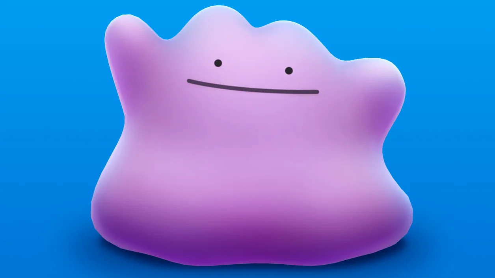
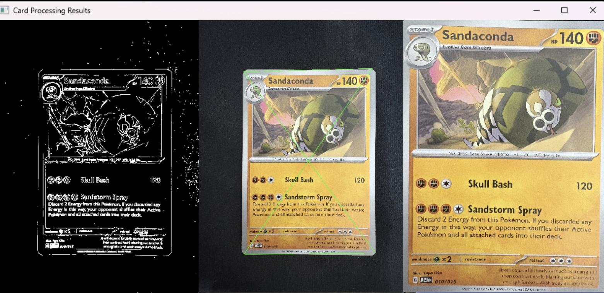
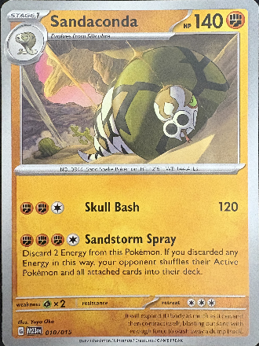

# DITTO - Digital Image Tagging and Trading-Card Observer 



### Group Members: Sam Lin, Devin Chen, Istab Rakin 

> [!WARNING] 
> This project is currently a work in progress and thus many features are either
> in an incomplete or broken state.  

## Build Instructions 

> [!IMPORTANT] 
> This project depends on OpenCV and that library must be installed on your
> computer to compile this project 

### Dependencies
```sh
Cmake
Make 
OpenCV # Must be accessible to CMAKE
``` 
 
### Compiling 

In the main directory (the directory with the CMakelists.txt) run: 

```sh
cmake . # creates a makefile for the project
make 
```

This would then output the binary `DITTO` which can then be run.

### Running the project 
> [!NOTE] 
> 
> 

```sh 
./DITTO <input_image> <template_image>
```

## Short Introduction 
Ditto is inspired by TAG grading. It is a trading card evaluation company that 
evaluates the quality of Pokémon cards and many different types of trading 
cards. The purpose of this project is to create a replica of TAG’s grading 
process and allow users to scan their own cards before evaluations through TAG 
by allowing the consumer to take a picture of their card and through some
computer vision algorithms, detect and trace defects to output a score on a 
scale of 1.0 through 10.0 (with 10 being the best). 

## Caveats 
Since Image Tagging usually requires a ring light and multiple cameras at 
different angles, we physically won't have as much data to work off of. So, this
would be a proof-of-concept for now (can we make a tagging system using easily 
accessible hardware) and fine tune it to an acceptable level? 


## Detecting the Card

In order to actually `TAG` the card, we do have to get a clean image of the card
itself. We initially set a standard card resolution of 330 by 440 pixels. 

So from the original image we create: 
- A greyscale image (we use this as a base as this is easier to work with). 
- A blurred image (with gaussian to reduce noise) 
- An edged image (image that determines the edges) 
- A Warped image (the corrected image of the card).



 

## Thresholding and Finding Deformities 

> [!WARNING] 
> This is currently in progress and will be done with some refactoring of the
> code. As of right now, the methodology stays the same. 

So, after we get the fixed image of just the card, we attempt to find major
deformities within the card, such as scratches, bends, dents, and fraying. 
This is done by blurring the image with a Gulssian mask. Next we find the 
gradient magnitude for edge detection. From this we will threshold the Gradient Magnitude with **n** percentile of max threshold.

Afterwards we filter filter out large areas within as these usually present the pokeballs, edges or giant text

Lastly we set a hough transform threshold to find detect lines with certain 
amount of votes. 

Very lastly we filter out lines that are of bigger than a certain area size. 


> [!CAUTION] 
> A lot of this remains unimplemented but here are some images of the progress 
> we have made 

 

## References
- https://github.com/NolanAmblard/Pokemon-Card-Scanner/tree/main 
- https://github.com/hj3yoo/mtg_card_detector 
- https://www.youtube.com/watch?v=BLy_YF4nmqQ 
- OpenCV Documentation